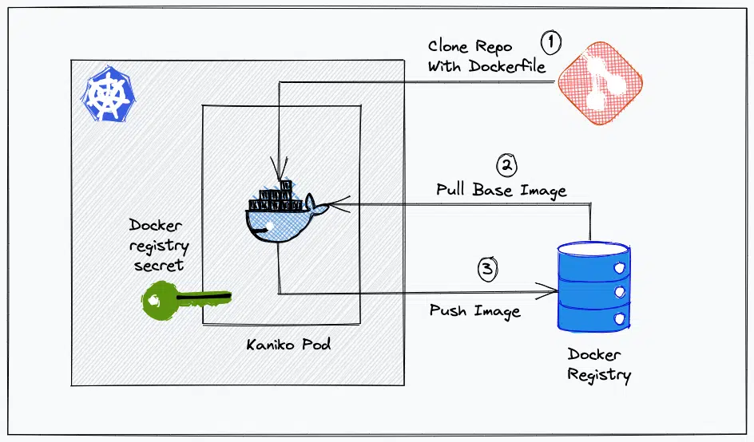
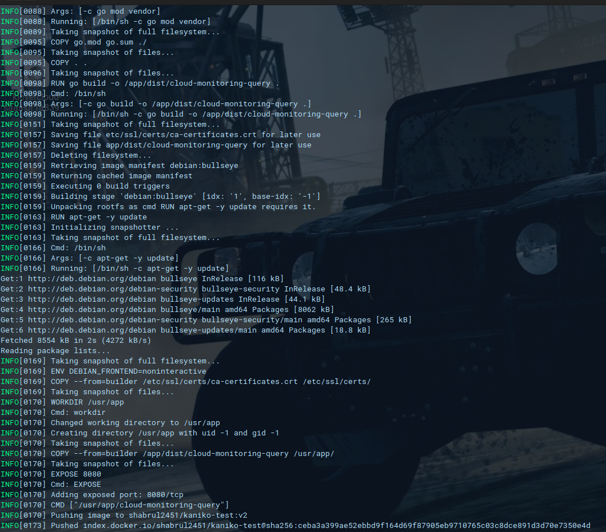

# Build and push by kaniko

Here is what you need
- A valid github repository with dockerfile
- A valid docker registry account
- Access to kubenetes cluster




### 1. Create Dockerhub Kubernetes Secret 

```bash
kubectl create secret docker-registry dockercred \
    --docker-server=https://index.docker.io/v1/ \
    --docker-username=<dockerhub-username> \
    --docker-password=<dockerhub-password>\
    --docker-email=<dockerhub-email>
```

[N:B:] Using dockerhub as container registry.

### 2. Deploy kaniko pod to build and push docker image

```yaml
apiVersion: v1
kind: Pod
metadata:
  name: kaniko
spec:
  containers:
  - name: kaniko
    image: gcr.io/kaniko-project/executor:latest
    args:
    - "--context=git://github.com/username/repository.git#develop"  # Use the branch you want
    - "--dockerfile=Dockerfile"  # Specify the correct path to your Dockerfile
    - "--destination=registry-username/kaniko-test:v2"
    env:
    - name: GIT_USERNAME
      value: <user-name>
    - name: GIT_PASSWORD
      value: <git-api-token>
    volumeMounts:
    - name: kaniko-secret
      mountPath: /kaniko/.docker
  restartPolicy: Never
  volumes:
  - name: kaniko-secret
    secret:
      secretName: dockercred
      items:
      - key: .dockerconfigjson
        path: config.json

```
* if you are using public repository you can ignore env section

Now deploy the pod.
```bash
kubectl apply -f kaniko-pod.yaml
```
To validate the docker image build and push, check the pod logs.

```bash
kubectl logs kaniko -f  
```


